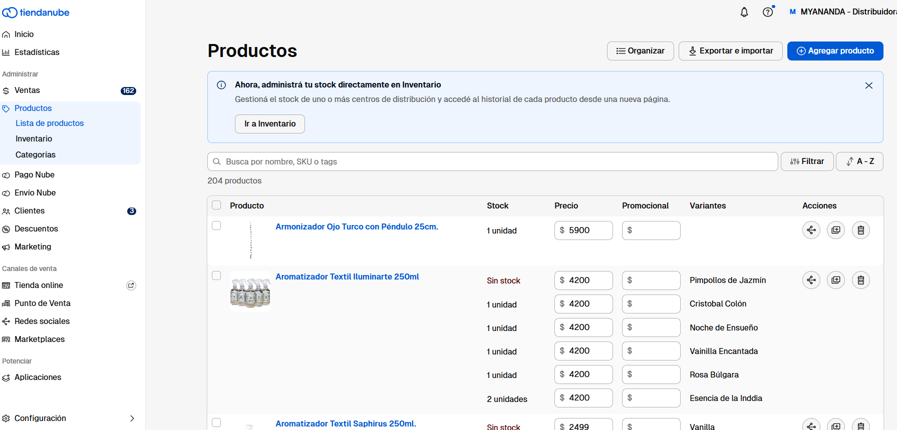

# Actualización de Precios en Tienda Nube y Showroom

**🎯 Objetivo**

Actualizar los precios de los productos en **Tienda Nube** y el **Showroom Comercial** de manera ordenada y precisa, alineando los costos con los precios mayoristas y minoristas establecidos en la hoja de cálculo de Google Drive.

***

### **🔹 PASO 1: Revisión y Actualización de Precios de Costo en Tienda Nube**

📌 **Responsable:** Usuario encargado de la actualización de precios.

#### **Instrucciones:**

1️⃣ Ingresar a la plataforma **Tienda Nube** con usuario y contraseña.\
2️⃣ Acceder a la sección **"Productos"** dentro del panel de administración.

<figure><figcaption></figcaption></figure>

\
3️⃣ Buscar cada producto y revisar el **precio de costo** actual.

4️⃣ Comparar los precios de costo con la última lista de precios de los proveedores.\
5️⃣ **Actualizar el campo "Precio de Costo"** (**Tener en cuenta que este proceso es super importante y sensible)** de cada producto con los valores más recientes proporcionados por los proveedores.&#x20;

Actualizacion de precios (sin variante)\
(Ver video)  [https://drive.google.com/file/d/1YAy1QClQBQrUKv56k4y-f\_Xo-74mcTgR/view?usp=sharing](https://drive.google.com/file/d/1YAy1QClQBQrUKv56k4y-f_Xo-74mcTgR/view?usp=sharing)

Actualizacion de precios (Con variante)

(Ver video)  [https://drive.google.com/file/d/1vBgWFqAXs0FD7f8fo7b-c7VW8eo8rBBs/view?usp=sharing](https://drive.google.com/file/d/1vBgWFqAXs0FD7f8fo7b-c7VW8eo8rBBs/view?usp=sharing)&#x20;

\
\
\
\
6️⃣ Revisar y confirmar que todos los precios fueron modificados correctamente.\
7️⃣ Notificar a Martin que la actualización de precios de costo ha sido completada.

***

### **PASO 2: Descarga del Archivo Maestro de Productos y Ejecución del Proceso de Actualización de Precios**

📌 **Responsable:** Martin

#### **Instrucciones:**

1️⃣ Ingresar a **Tienda Nube** con tu usuario y contraseña.\
2️⃣ Dirigirse a la sección de **Exportación de Productos** y descargar el archivo **Excel del Maestro de Productos**.  (Ver video)

[https://drive.google.com/file/d/1YMVst86YmrcOriqRSfrap4FsbFO99Oc6/view?usp=sharing](https://drive.google.com/file/d/1YMVst86YmrcOriqRSfrap4FsbFO99Oc6/view?usp=sharing)

&#x20;3️⃣ Subir archivo en la carpeta d\_Producto y Copiar el ID de documento.

(Ver video) [https://drive.google.com/file/d/17xBoYgY\_jM9Chr79ip-6FjipdyDPrnv\_/view?usp=sharing](https://drive.google.com/file/d/17xBoYgY_jM9Chr79ip-6FjipdyDPrnv_/view?usp=sharing) \

3️⃣ Ejecutar el **proceso de actualización de precios mayoristas y minoristas** en la plataforma.\
4️⃣ Confirmar que la actualización se haya reflejado correctamente en todos los productos.\
5️⃣ Notificar al usuario encargado que el proceso ha sido realizado con éxito para que pueda proceder con la actualizacion de precios mayorista y minorista.

***

### **🔹 PASO 3: Lista de Precios de Ventas**&#x20;

📌 **Responsable:** Usuario encargado de la actualización de precios.

#### **Instrucciones:**

1️⃣ Ingresar a la **carpeta Comercial-->Lista en Google Drive**.\
2️⃣ Abrir el archivo **Google Sheet** con la lista de precios mayoristas y minoristas.\
3️⃣ **Comparar los precios de Tienda Nube** con los de la **columna "Precio Mayorista"** en el Google Sheet (Excel) .\
4️⃣ Si se detectan diferencias, actualizar los precios en Tienda Nube para que coincidan con la información del Google Sheet (Excel).\
5️⃣ Para la actualización de precios en el **Showroom Comercial**, tomar como referencia la **columna "Precio Minorista"** del Google Sheet (Excel) .\
6️⃣ Verificar que todos los precios en Tienda Nube y Showroom hayan sido actualizados correctamente.\
(Ver Video)\
[https://drive.google.com/file/d/1iYZL3tlPzkFp\_Wo5VD7b1IYV\_oyUbVYf/view?usp=drive\_link](https://drive.google.com/file/d/1iYZL3tlPzkFp_Wo5VD7b1IYV_oyUbVYf/view?usp=drive_link)

***

### **🔹 PASO 4: Confirmación y Cierre del Proceso**

📌 **Responsable:** Usuario encargado de la actualización de precios.

#### **Instrucciones:**

1️⃣ Realizar una última verificación en **Tienda Nube y el Showroom** para confirmar que los precios coincidan con la hoja de Google Sheet.\
2️⃣ En caso de encontrar diferencia, corregirlas de inmediato.\
3️⃣ Notificar a Martin que la actualización de precios ha sido **completada correctamente**.\
4️⃣ **Registrar la finalización del proceso atraves de un mensajes**&#x20;

***

### **✅ Consideraciones Finales**

✔️ Este procedimiento debe realizarse **de manera periódica** para garantizar que los precios reflejen los costos actualizados de los proveedores.\
✔️ Antes de realizar cambios masivos, se recomienda **hacer un respaldo** del archivo de productos de Tienda Nube.\
✔️ Es importante que la comunicación entre el usuario y el administrador (Martin) sea clara y oportuna para evitar errores en la actualización de precios.

***

**🔹 Con este procedimiento estructurado paso a paso, aseguramos que los precios en Tienda Nube y Showroom Comercial estén correctamente alineados y actualizados de manera eficiente.** 🚀
